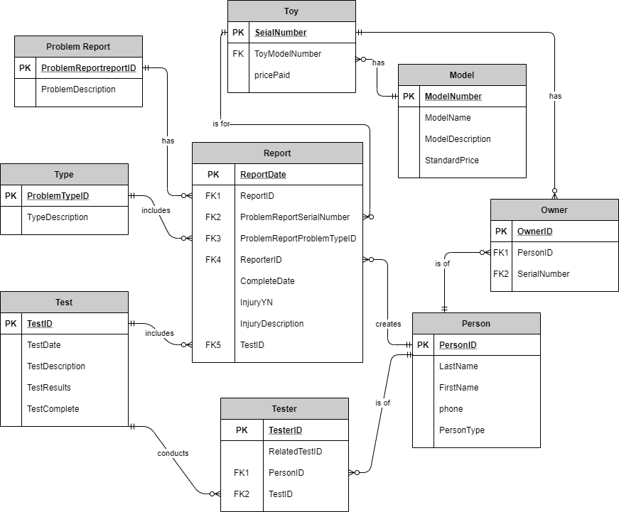
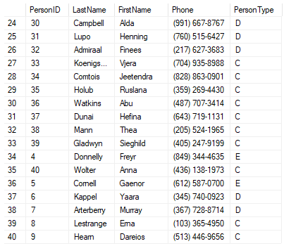
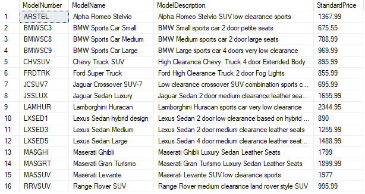
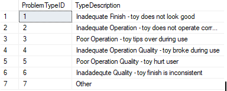
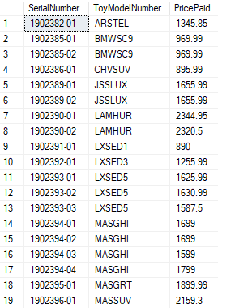
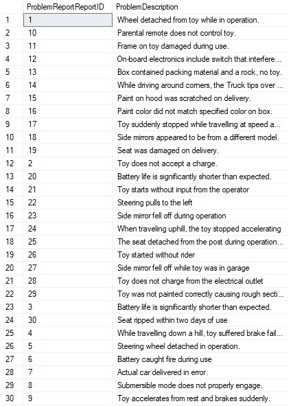
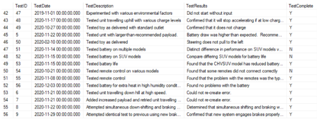
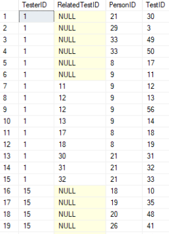
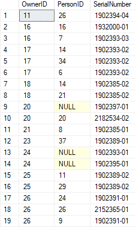
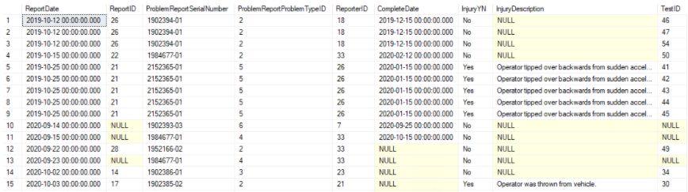

# Replica Toy Project
:speech_balloon: The two objectives to this project are to __design a database__ to support the requested operations of the company and __create a prototype__ to test the design.

## Database Design



## Prototype Database Creation
### 1. **Person**
```
CREATE TABLE xPerson
(
	PersonID	INT PRIMARY KEY NOT NULL,
	LastName	VARCHAR(100) NOT NULL,
	FirstName	VARCHAR(100) NOT NULL,
	phone	CHAR(20) NOT NULL,
	PersonType	VARCHAR(3) NOT NULL
)
```

### 2. **Model**
```
CREATE TABLE xModel
(
	ModelNumber	VARCHAR(30) PRIMARY KEY NOT NULL,
	ModelName	VARCHAR(100) NOT NULL,
	ModelDescription	VARCHAR(100) NOT NULL,
	StandardPrice	MONEY
)
```

### 3. **Type**
```
CREATE TABLE xType
(
	ProblemTypeID	INT PRIMARY KEY NOT NULL,
	TypeDescription	VARCHAR(100) NOT NULL
)
```

### 4. **Toy**
```
CREATE TABLE xToy
(
	SerialNumber	VARCHAR(30) PRIMARY KEY NOT NULL,
	ToyModelNumber	VARCHAR(30) FOREIGN KEY REFERENCES xModel(ModelNumber) NOT NULL,
	PricePaid	MONEY NOT NULL
)
```

### 5. **Problem Report**
```
CREATE TABLE xProblemReport
(
	ProblemReportReportID VARCHAR(30) PRIMARY KEY NOT NULL,
	ProblemDescription	VARCHAR(100) NOT NULL
)
```

### 6. **Test**
```
CREATE TABLE xTest
(
	TestID	INT PRIMARY KEY NOT NULL,
	TestDate	DATETIME NOT NULL,
	TestDescription VARCHAR(100) NOT NULL,
	TestResults	VARCHAR(100) NOT NULL,
	TestComplete CHAR(3) NOT NULL
)
```

### 7. **Tester**
```
CREATE TABLE xTester
(
	TesterID	INT PRIMARY KEY NOT NULL,
	RelatedTestID	INT,
	PersonID	INT FOREIGN KEY REFERENCES xPerson (PersonID) NOT NULL,
	TestID	INT FOREIGN KEY REFERENCES xTest (TestID)	NOT NULL
)
```

### 8. **Owner**
```
CREATE TABLE xOwner
(
	OwnerID INT PRIMARY KEY NOT NULL,
	PersonID	INT FOREIGN KEY REFERENCES xPerson (PersonID) NOT NULL,
	SerialNumber	INT FOREIGN KEY REFERENCES xToy (SerialNumber) NOT NULL
)
```

### 10. **Report**
```
CREATE TABLE xReport
(
	ReportDate	DATETIME NOT NULL,
	ReportID	INT FOREIGN KEY REFERENCES xProblemReport (ProblemReportReportID) NOT NULL,
	ProblemReportSerialNumber	INT FOREIGN KEY REFERENCES xToy (SerialNumber) NOT NULL,
	ProblemReportProblemTypeID	INT FOREIGN KEY REFERENCES xType (ProblemTypeID) NOT NULL,
	ReporterID	INT FOREIGN KEY REFERENCES xPerson (PersonID) NOT NULL,
	CompleteDate	DATETIME,
	InjuryYN	CHAR(3) NOT NULL,
	InjuryDescription	VARCHAR(100),
	TestID	INT FOREIGN KEY REFERENCES xTest (TestID) NOT NULL
)
```


## SQL Queries
:point_right: [View the queries here!](https://github.com/kaitlynhyz/is-475/blob/main/replica_toy_project.sql)
